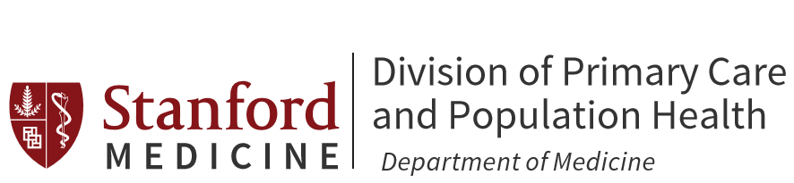

# Instructions

Please see the instructions on the site [https://www.studentcorps.site/instructions](https://www.studentcorps.site/instructions). These instructions and the documents in this folder represent our best practices following our experiences so far, and will be updated frequently. If you have any suggestions for changes/additions, please [let us know](https://www.studentcorps.site/instructions/about/#contact).

*If you do implement such a program, please have volunteers fill out this survey prior to starting and after ending, or after two months, whichever comes first:*

*[https://mdd.li/studentcorpsstudy](https://mdd.li/studentcorpsstudy)*

*Then, after each call, please fill out the following, very short, post-call survey:*

*[https://mdd.li/postcall](https://mdd.li/postcall)*

*These will help us get an idea of who is using the idea, and what kind of impact it is having. Thanks!*

# Resources

All of the resources are `.docx` documents in the [GitHub repository](https://www.github.com/MikeDacre/studentcorps), it is highly recommended that you alter them to meet your practice environment.

You can download all the documents as a package here: https://github.com/MikeDacre/studentcorps/releases

## Clinician and Department Resources

- [Preceptor Guide](https://github.com/MikeDacre/studentcorps/blob/master/Resources/Clinician_Materials/Physician_Preceptor_Guide_Student_CORPS.docx): This document is a template for use in on-boarding clinicians and familiarizing them with the program. It includes a copy of the [Epic template](https://github.com/MikeDacre/studentcorps/blob/master/Resources/Templates/Epic_Note_Template.docx).
- [Consent Template](https://github.com/MikeDacre/studentcorps/blob/master/Resources/Clinician_Materials/Physician_Extender_Clincian_Consent.docx): This is an example of language that can be used for before-time patient consent.
- [Doximity instructions](https://github.com/MikeDacre/studentcorps/blob/master/Resources/Tech_Instructions/Doximity_Instructions.docx): Instructions for faculty and students who want to use Doximity to call from personal cell-phones using the clinic call back number.

## Student Resources

- [Student On-boarding](https://github.com/MikeDacre/studentcorps/blob/master/Resources/Student_Materials/Student_CORPS_On-Boarding.docx): A template for student on-boarding. Should be edited by the department to match department policies prior to use.
- [Example pre-clinical script](https://github.com/MikeDacre/studentcorps/blob/master/Resources/Student_Materials/Preclin_Guidelines_and_Script.docx): Guidelines to refer to on each call with example language to use on the call.
- [Doximity instructions](https://github.com/MikeDacre/studentcorps/blob/master/Resources/Tech_Instructions/Doximity_Instructions.docx): Instructions for faculty and students who want to use Doximity to call from personal cell-phones using the clinic call back number.
- [Epic Instructions](https://github.com/MikeDacre/studentcorps/blob/master/Resources/Tech_Instructions/Epic_for_Calls.docx): Instructions for how to use Epic to create a new phone call encounter and note. Instructions are specific to the Stanford Epic instance, but should be similar for other institutions.
- [Call Tracking Log](https://github.com/MikeDacre/studentcorps/blob/master/Resources/Templates/Call_Tracking_Log.xlsx): An Excel spreadsheet that can be used for tracking calls over time. Take care to store in a PHI-secure way.

### Templates

These templates can be used for making notes on calls.

- [Epic template](https://github.com/MikeDacre/studentcorps/blob/master/Resources/Templates/Epic_Note_Template.docx): A template that can be added to your Epic SmartPhrases and entered into your notes with the `.wellphone` dotphrase. Includes instructions at the top for how to add it to your Epic instance.
- [Word doc template](https://github.com/MikeDacre/studentcorps/blob/master/Resources/Templates/Call_Log_Note_Template.docx): A Word document version of the Epic template for those without EHR access. Be sure to store in a PHI-secure way.

